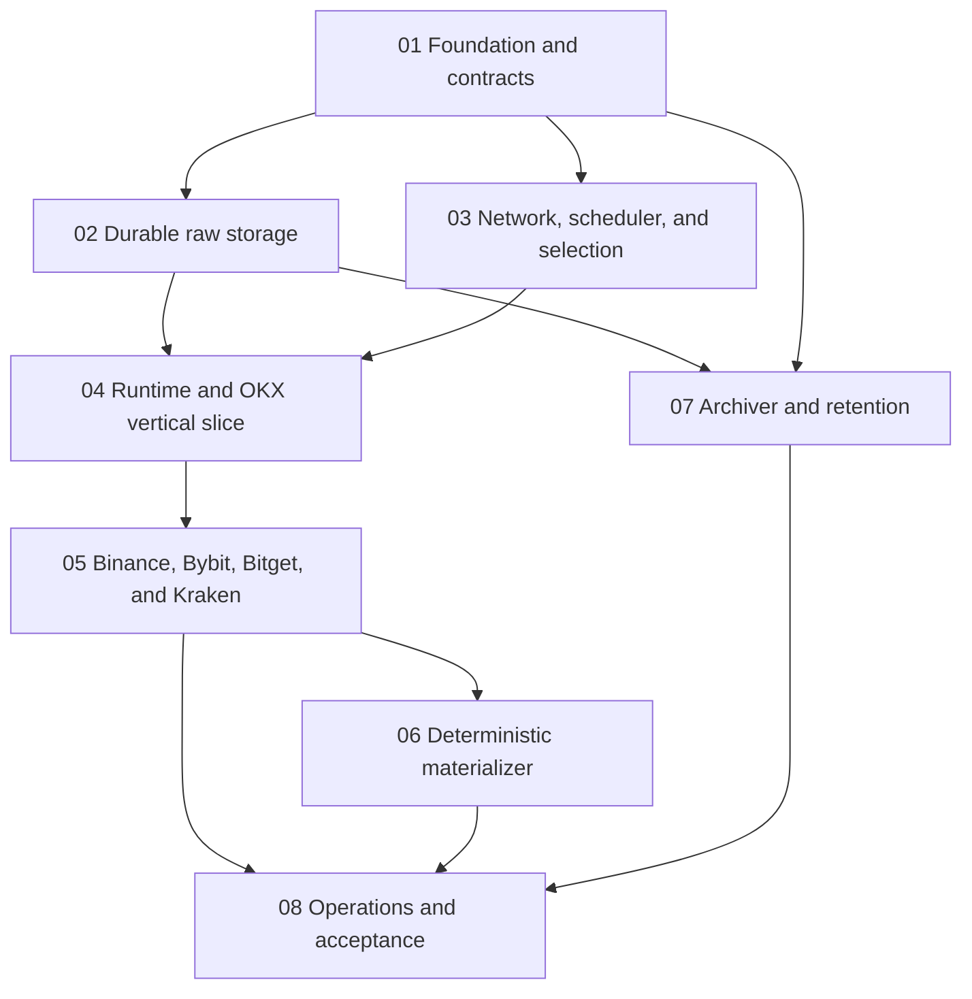

# Crypto Market Data Collector Implementation Roadmap

> **For agentic workers:** REQUIRED SUB-SKILL: Use superpowers:subagent-driven-development (recommended) or superpowers:executing-plans to implement this plan task-by-task. Steps use checkbox (`- [ ]`) syntax for tracking.

**Goal:** Deliver the approved five-exchange, file-first public market-data collector as a sequence of independently testable increments.

**Architecture:** A Python package exposes three isolated top-level processes: collector, materializer, and archiver. Exchange workers emit immutable raw files and manifests; materialization and archival consume only closed manifests and can never backpressure collection.

**Tech Stack:** Python 3.11+, asyncio, Pydantic, HTTPX with SOCKS, websockets, python-zstandard, PyArrow, SQLite, boto3, oss2, Prometheus client, Typer, pytest, Hypothesis.

---

## Approved Input

The normative design is [`docs/superpowers/specs/2026-07-31-crypto-market-data-collector-design.md`](../specs/2026-07-31-crypto-market-data-collector-design.md). Exchange protocol evidence is versioned under `docs/exchanges/`. When a plan and the design disagree, stop and resolve the design rather than silently choosing one.

## Delivery Graph



Plans 02 and 03 may run in parallel after plan 01. Plan 07 may begin once the raw envelope and closed-manifest schemas are frozen by plans 01 and 02. Plan 05 follows the OKX vertical slice; Plan 06 follows Plan 05 because its live-book replay imports every venue's finalized transition API. Plan 08 is the integration gate.

## Plan Suite

| Order | Plan | Working outcome |
| --- | --- | --- |
| 01 | [`2026-07-31-collector-foundation.md`](2026-07-31-collector-foundation.md) | Installable package, strict layered configuration, capability registry, stable domain contracts, and `collector config check`. |
| 02 | [`2026-07-31-durable-raw-storage.md`](2026-07-31-durable-raw-storage.md) | Independent zstd frames, bounded group sync, rotation, manifests, recovery, and a durability benchmark gate. |
| 03 | [`2026-07-31-network-scheduler-selection.md`](2026-07-31-network-scheduler-selection.md) | Direct/SOCKS egress pool, per-quota-group budgets, retries, interval stretching, fixed/Top-N/new-listing selection, and capacity admission. |
| 04 | [`2026-07-31-runtime-okx-slice.md`](2026-07-31-runtime-okx-slice.md) | A real OKX Spot and perpetual collector writing validated raw files through the production worker/supervisor boundary. |
| 05 | [`2026-07-31-remaining-exchange-connectors.md`](2026-07-31-remaining-exchange-connectors.md) | Binance, Bybit, Bitget, and Kraken adapters with exchange-specific book integrity and public research streams. |
| 06 | [`2026-07-31-deterministic-materializer.md`](2026-07-31-deterministic-materializer.md) | Configurable 30s+ Parquet trade, book, derivative, and quality windows with deterministic lineage and revisions. |
| 07 | [`2026-07-31-archiver-retention.md`](2026-07-31-archiver-retention.md) | OSS, S3-compatible, and mounted-filesystem archival, optional compression, restore/verify, cleanup gates, and tombstones. |
| 08 | [`2026-07-31-operations-acceptance.md`](2026-07-31-operations-acceptance.md) | Observability, disk-pressure control, Compose deployment, lifecycle/fault injection, and final performance evidence. |

## Spec Coverage Map

| Approved spec sections | Owning plan/tasks |
| --- | --- |
| 1-4 goals, non-goals, terminology, data boundary | 01 tasks 1-4; roadmap frozen contracts |
| 5 architecture/process isolation | 04 tasks 2 and 6; 08 tasks 3-4 |
| 6 exchange capabilities/default research data | 04 tasks 3-5; 05 tasks 1-5 |
| 7 fixed/Top-N/new listing | 03 tasks 5-6 |
| 8 layered config, strict check/probe, reload | 01 tasks 3-6; 03 task 6; 04 tasks 5-6; 05 task 5 |
| 9 egress, quota groups, retry, scheduler | 03 tasks 1-4 and 6 |
| 10 separate live/deep book products | 04 tasks 3-5; 05 tasks 1-4; 06 tasks 4-5 |
| 11 raw paths, envelope, durability, manifest, recovery | 01 task 2; 02 tasks 1-7 |
| 12 configurable 30s+ materialization and revisions | 06 tasks 1-7 |
| 13 OSS/S3/mounted WebDAV, compression, retention | 07 tasks 1-7; 08 task 2 |
| 14 queues, failure matrix, shutdown | 02 tasks 3-6; 04 tasks 2 and 6; 08 tasks 2 and 5 |
| 15 logs, status, health, bounded metrics | 08 tasks 1-2 and 5 |
| 16 CLI and Compose | 01 task 6; 03 task 6; 04 tasks 6-7; 06 task 7; 07 task 6; 08 task 3 |
| 17 anonymous/security boundary and redaction | 01 tasks 3-6; 03 task 1; 04 task 1; 08 task 5 |
| 18 offline/live/E2E/performance tests | Every plan's red-green checks; 08 tasks 4-7 |
| 19 schema/API drift | 01 tasks 2 and 5; 04 tasks 1 and 7; 05 tasks 1-6; 08 task 7 |
| 20 accepted tradeoffs | Enforced by stage gates A-E |
| 21 completion definition | 08 task 7 final acceptance record |

## Frozen Cross-Module Contracts

These contracts are established before connector work and may only change through a migration commit that updates every consumer and fixture:

```python
@dataclass(frozen=True, slots=True)
class AcceptedRecord:
    envelope: RawEnvelope
    encoded_jsonl: bytes

    @property
    def accepted_monotonic_ns(self) -> int:
        return self.envelope.monotonic_ns


class EventSink(Protocol):
    def try_emit(self, draft: NativeEventDraft, source: SourceContext,
                 *, shard: str) -> EnqueueResult: ...


class ExchangeAdapter(Protocol):
    exchange: Exchange
    async def probe(self, runtime: AdapterRuntime) -> CapabilityProbe: ...
    async def fetch_catalog(self, runtime: AdapterRuntime, market: Market) -> InstrumentCatalog: ...
    def plan(self, request: CollectionRequest) -> AdapterPlan: ...
    async def run(self, plan: AdapterPlan, runtime: AdapterRuntime, sink: EventSink) -> None: ...
```

Raw paths, envelope fields, manifest fields, archive receipts, derived manifests, and ACKs each carry an independent integer `schema_version`. Stable instrument keys group protocol-specific wire symbols; payloads are never rewritten into a cross-exchange raw schema.

Canonical ownership/import paths are fixed before parallel work:

| Contract | Canonical module | Owner |
| --- | --- | --- |
| `RawEnvelope`, `NativeEventDraft`, `SourceContext`, `RestMetadata`, JSON payload types | `crypto_collector.domain.envelope` | Plan 01 |
| `AcceptedRecord`, `EnqueueResult`, `RawIngress` | `crypto_collector.storage.models` / `.ingress` | Plan 02 |
| `ExchangeWriterLock`, `RawWriterService`, `WriterStatus` | `crypto_collector.storage.writer_lock` / `.service` | Plan 02 |
| `ProbeProvider`, `ProbeEngine`, `ProbeReport` | `crypto_collector.config.probe_contracts` | Plan 03 |
| `ConnectionGeneration`, `EventSink`, adapter request/plan/catalog/runtime types | `crypto_collector.exchanges.contracts` | Plan 04 before venue work |
| `RawManifestV1`, close reasons and validators | `crypto_collector.storage.manifest` | Plan 02 |

The connector returns a `NativeEventDraft` plus runtime-issued `SourceContext` and the storage shard ID assigned to its plan item; the runtime `EventSink` delegates synchronously to `RawWriterService.try_accept(draft, source=source, shard=shard)`, which owns one `RawIngress`. Ingress owns worker/config identity, attaches source metadata, allocates `writer_sequence`, stamps the authoritative `RawEnvelope.received_at_ns` and `monotonic_ns`, serializes once, and performs the nonblocking queue insert. Runtime calls only the concrete `RawWriterService` lifecycle methods frozen and tested by Plan 02; it never directly acquires a writer lock, calls a stream writer, or invents a second sink/close interface.

## Non-Negotiable Stage Gates

### Gate A: Offline determinism

- [ ] A clean environment installs each role from its committed hash-locked requirements file.
- [ ] `python -m pytest -q -m "not live and not performance"` performs no external DNS or socket connection.
- [ ] Two config resolutions with identical references produce the same SHA-256 even when secret values change.
- [ ] Percent encoding round-trips every non-empty UTF-8 instrument key accepted by the path policy and cannot collide with `_market` or `_control`.

### Gate B: Raw durability before connector fan-out

- [ ] The target host and filesystem are recorded in the benchmark report.
- [ ] The benchmark runs by immutable container image ID, and the injected runtime/expected IDs match that recorded ID.
- [ ] The per-instrument/per-stream writer is exercised for at least 10 minutes at twice the versioned workload's record rate and active-file count.
- [ ] Every accepted record has `durability_lag <= 1.000s`, memory remains bounded, and no queue loss lacks a control record.
- [ ] If the gate fails, stop connector expansion and write a design amendment for a journal/group-commit layout. Do not relax the SLO or silently reduce the tested stream count.

### Gate C: Connector correctness

- [ ] Every adapter passes offline catalog, subscription, heartbeat, schema-drift, reconnect, and book-integrity fixtures.
- [ ] Every venue's mandatory Hypothesis book state-machine suite generates legal chains plus mutated gaps/checksums/resets and proves an invalid generation cannot silently self-heal.
- [ ] No adapter accepts credentials or calls private/account/order endpoints.
- [ ] Live API tests remain opt-in through `RUN_LIVE_API_TESTS=1`.
- [ ] A gap invalidates that connection generation and emits `_control`; it is never hidden by sampling.

### Gate D: Consumer isolation

- [ ] Materializer and archiver read only closed manifests and ignore `.partial` files.
- [ ] Killing or slowing either consumer does not change collector queues, connection state, or durability lag.
- [ ] Raw cleanup cannot occur before all required archive receipts and, when enabled, the materializer ACK exist.

### Gate E: Final acceptance

- [ ] Five exchanges collect supported Spot and linear-perpetual public streams for fixed pairs.
- [ ] Fixed pairs, quote-local Top N, and active new listings form the configured union without silent capacity omission.
- [ ] 30s and 1m outputs rerun to the same canonical rows SHA-256 under shuffled input discovery.
- [ ] One required archive target completes upload, strong verification, restore, and source-hash verification.
- [ ] REST 429, WebSocket disconnect, queue overflow, worker kill, sync delay, low disk, and multipart interruption produce the specified scoped state transitions.
- [ ] Logs, metrics, manifests, receipts, status output, and tracebacks pass the credential-redaction test corpus.

## Commit and Review Discipline

Each detailed plan uses red-green-refactor steps and ends every independently useful task with a commit. Shared contracts are reviewed before parallel connector tasks begin. The recommended implementation branch starts from a clean worktree created with `superpowers:using-git-worktrees`; implementation then uses `superpowers:subagent-driven-development` with specification review followed by code-quality review for every task.

## Execution Commands

Run the complete offline suite after each plan:

```bash
.venv/bin/python -m pytest -q -m "not live and not performance"
```

Run live exchange checks only at an explicit checkpoint:

```bash
RUN_LIVE_API_TESTS=1 .venv/bin/python -m pytest -q -m live
```

Run the storage gate only on the declared target data volume:

```bash
install -d -m 0750 /declared/target/data /declared/target/state/reports
docker image inspect --format '{{.Id}}' crypto-collector:test \
  > /declared/target/state/reports/collector-image.id
COLLECTOR_BENCH_IMAGE_ID="$(sed -n '1p' /declared/target/state/reports/collector-image.id)"
docker run --rm \
  --network none \
  --env COLLECTOR_RUNTIME_IMAGE_ID="$COLLECTOR_BENCH_IMAGE_ID" \
  --mount type=bind,src=/declared/target/data,dst=/data \
  --mount type=bind,src=/declared/target/state,dst=/state \
  "$COLLECTOR_BENCH_IMAGE_ID" python -m crypto_collector.benchmarks.writer \
  --workload /app/benchmarks/workloads/research-default-v1.yaml \
  --multiplier 2 \
  --duration 10m \
  --data-root /data \
  --expected-image-id "$COLLECTOR_BENCH_IMAGE_ID" \
  --report /state/reports/writer-durability.json
```

Expected result: exit code `0`, runtime/expected image IDs exactly match the immutable ID used by `docker run`, exact 2x workload/cardinality conformance, continuously healthy storage samples, `accepted_count == durable_count`, `durability_lag_max_ns <= 1000000000`, and `unrecorded_loss_count == 0`.
