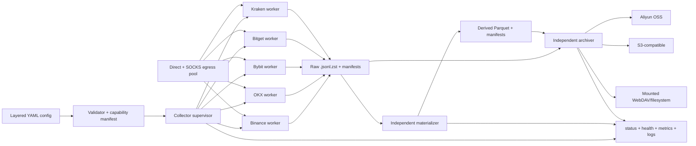

# 主流加密货币交易所实时市场数据采集系统设计

- 日期：2026-07-31
- 状态：设计已在对话中分节批准，等待书面规格复核
- 语言与运行时：Python 3.11+
- 首期交易所：Binance、OKX、Bybit、Bitget、Kraken
- 首期市场：Spot、线性永续合约

## 1. 摘要

本项目构建一个长期运行、只读、匿名的市场数据采集系统。它从五家交易所的公开 REST 和 WebSocket API 实时获取成交、ticker、盘口、衍生品指标、强平/风险数据、产品目录与平台状态，保存为可追溯的本地文件。它不下单，不访问账户、仓位、钱包或任何私有频道。

实时链路的唯一职责是尽可能完整地接收原始事件并可靠写盘。时间窗口聚合由独立的离线 `materializer` 执行；远端备份由独立的 `archiver` 执行。两者都消费已经关闭且带 manifest 的文件，不能反向阻塞实时采集。

系统只定义两种盘口研究产品：

1. `book_live`：高频 WebSocket 盘口。
2. `book_deep_snapshot`：低频 REST 深度快照。

两者不桥接、不合并，也不拼成“连续深度盘口”。Binance diff book 和 Bybit full book 所需的 REST bootstrap 仅属于 `book_live` 协议内部初始化，不是周期性 `book_deep_snapshot`。

## 2. 目标

### 2.1 功能目标

- 同时采集五家交易所的 Spot 与线性永续公共市场数据。
- 交易对集合为：固定对、各交易所各市场的 24 小时报价币成交额 Top N、新上市品种三者的并集。
- 默认报价币为 USDT；固定对可绕过报价币过滤；交易所和市场可以覆盖默认报价币。
- 新上市采集窗口、Top N、固定对、频道、盘口深度、REST 快照周期都可配置。
- 支持 direct 与多个 SOCKS5/SOCKS5h 出口；传输健康/连接数按 egress 管理，IP 级限频/ban 按可配置 quota group 管理。
- 原始数据写入按交易所、市场、稳定 instrument key、逻辑 stream 和 UTC 时间分区的 `.jsonl.zst` 文件，并在 envelope 中同时保留实际 wire symbol。
- 独立生成 `30s`、`1m`、`5m`、`15m`、`1h` 等可配置时间窗口的 Parquet 数据。
- 支持 Aliyun OSS、S3-compatible 和已挂载 WebDAV/filesystem 三类备份目标。
- 所有自动降频、重连、gap、配置变更、归档失败和磁盘压力都可观测、可追溯。

### 2.2 质量目标

- 在已声明的健康存储环境和 2 倍预计峰值负载下，每条 accepted record 的 `durability_lag`（记录的 `monotonic_ns` 到包含它的 zstd frame 完成 `fdatasync/fsync` 的单调时钟差）不得超过 1.000 秒。存储阻塞或故障造成的越界必须可观测并触发安全动作；该 SLO 不是对操作系统、硬件或断电故障的零丢失保证。
- 不静默抽样或忽略已检测到的数据缺口；检测到的 gap 必须进入 `_control` 数据与指标。
- 原始 payload 的字段名、嵌套结构和值语义保持交易所原样。
- 文件、派生结果和归档对象均具有确定性 lineage 与强 checksum。
- 单个交易所、归档目标或 materializer 故障不影响其他实时 worker。
- 普通 CI 不访问公网；真实交易所和真实对象存储测试显式 opt-in。

## 3. 非目标

- 私有账户、订单、仓位、余额、钱包、充值提现和任何交易执行。
- 需要认证或权限等级的市场数据，例如 OKX VIP 10ms 深度和 Kraken token-only L3。
- 历史全量回补；周期 REST 任务只获取最新快照或配置允许的短窗口参考数据。
- 跨交易所联表、现货与永续组合信号、交易策略、回测或执行引擎。
- 实时派生数据库、分析仪表盘或 Web UI。
- 将 `book_live` 与 `book_deep_snapshot` 合成为连续深簿。
- 同时采集所有重复 depth view 和所有交易所原生 K 线周期。
- v1 主动删除远端对象；远端生命周期由 OSS/S3/WebDAV 管理侧配置。
- 内置 WebDAV HTTP 客户端；WebDAV 只作为外部可靠挂载后的 filesystem 目标。
- 首期以外的 Gate、KuCoin、Coinbase、Deribit 等交易所。

## 4. 术语与数据边界

| 术语 | 定义 |
| --- | --- |
| canonical pair | 用户配置使用的统一表示，例如 `BTC/USDT`。只用于选择和显示。 |
| instrument key | connector 从产品目录确定的稳定 `exchange × market` 品种身份，用于选择、路径和跨 REST/WS 归组，例如 OKX `BTC-USDT-SWAP`、Kraken Spot `BTC/USDT`、Kraken Futures `PF_XBTUSD`。 |
| wire symbol | 当前 REST/WS 协议实际请求或返回的原生标识。一个 instrument key 可以有多个 wire symbol，例如 Kraken Spot REST 的 `XBTUSDT` 与 WS v2 的 `BTC/USDT`；envelope 必须保存实际值。 |
| raw | 交易所事件或 REST 响应加采集 envelope 后的记录，不做字段标准化。 |
| accepted record | connector 已完成最小协议校验并提交 draft，runtime ingress 已生成最终 envelope、序列化并成功 `put_nowait` 到 raw writer queue 的记录；durability SLO 从 envelope 的 `monotonic_ns` 开始计时。 |
| control | 连接、订阅、gap、限频、配置、恢复、轮转和暂停等运行事件。 |
| closed manifest | 数据文件已关闭、fsync、重命名后生成的不可变元数据与 SHA-256。 |
| derived | materializer 从 closed raw manifests 确定性生成的 Parquet 数据。 |
| live bootstrap | 交易所协议要求的 `book_live` 初始化快照，仅用于该 WS connection generation。 |
| deep snapshot | 独立、周期性的 REST 深度研究快照，不参与 live book 修复。 |
| egress | 一个 direct 或 SOCKS 代理连接出口，具有独立传输健康和并发状态。 |
| quota group | 一个或多个已知共享公网 NAT/IP 限额的 egress 集合；交易所 token budget、ban 和 cooldown 按它统计。 |

“payload 原样”指保留交易所字段名、嵌套结构、数组顺序、JSON primitive 类型、字符串和数值语义，不把不同交易所字段改写为统一 schema。它不承诺 JSON 空白、对象 key 顺序或数字字面量的 wire-byte 完全一致。JSON number 使用 Decimal-aware decoder/encoder，不能经过二进制浮点再写盘；协议校验必须使用交易所要求的原始字符串字段，例如 Kraken Spot CRC32 不能先把 price/qty 转为二进制浮点数。

## 5. 总体架构



### 5.1 进程模型

- `collector supervisor` 是一个顶层进程，为每家已启用交易所启动一个独立 OS worker。
- 每个 exchange worker 独占其连接、订阅状态、速率预算、内存队列与 raw writers。
- supervisor 负责两阶段配置 reload、子进程健康与带抖动退避重启，不解析交易所行情。
- `materializer` 和 `archiver` 是独立顶层进程，只读取 closed manifests。
- Docker Compose 运行三个顶层服务：`collector`、`materializer`、`archiver`。collector 内部 supervisor 是 exchange child 的唯一重启所有者；Compose 只在顶层服务退出时重启服务，避免双层重启循环。
- CLI 本地运行使用相同进程边界，不提供另一套执行模型。

### 5.2 模块职责

| 模块 | 责任 | 不负责 |
| --- | --- | --- |
| config resolver | 合并配置、严格校验、能力检查、计算配置哈希和容量预算 | 网络连接、写盘 |
| selector | 维护 fixed、Top N、new listing 并集和变更原因 | 订阅协议 |
| exchange adapter | 官方协议、symbol 映射、频道、heartbeat、序列与 schema 解读 | 跨交易所标准化 |
| egress manager | direct/SOCKS 客户端、sticky 分配、预算、熔断和重试分类 | 业务优先级决策 |
| scheduler | REST 优先队列、requested/effective interval | 写 raw payload |
| raw writer | envelope、压缩、flush、轮转、恢复、manifest | 聚合分析 |
| materializer | 时间窗口、盘口重放、Parquet、revision、lineage | 实时订阅、跨交易所分析 |
| archiver | 上传、强校验、receipt、重试与本地清理资格 | 远端生命周期删除 |
| observability | status、health、metrics、JSON logs、control events | 数据修复 |

## 6. 交易所能力与日期敏感约束

详细证据、官方 URL、抓取时间和 SHA-256 位于 [`docs/exchanges/README.md`](../../exchanges/README.md)。这些资料是 2026-07-31 的版本化设计输入，不是永久 API 契约。实现或修改 connector 前必须重新抓取官方资料并运行 live smoke tests。

| 交易所 | `book_live` | `book_deep_snapshot` | 重要约束 |
| --- | --- | --- | --- |
| Binance | Spot/Futures diff depth；分别用 `U/u` 和 `pu/u` 检查连续性 | Spot 最大 5000 档、Futures 最大 1000 档 | diff book 需要协议内部 REST bootstrap；Futures 必须使用显式 `/market` 和 `/public` 路由；连接最长 24h；`forceOrder` 是有损窗口快照；OI 走 REST。 |
| OKX | 匿名 `books`：400 档 snapshot + 100ms delta | `books-full` 最大 5000 档、约 1s 缓存 | 2026-06-23 后 checksum 固定为 0，只使用 `seqId/prevSeqId`；合法空 heartbeat 和维护序列回退不能误判为 gap；10ms L2 需认证/VIP4，排除。 |
| Bybit | 标准 1/50/200/1000 depth；Spot full book 可选 | 标准最大 1000；full REST 最大 10000 | 标准 feed 自带 WS snapshot；full feed 为 delta-only 并需 REST bootstrap。资料日 full book 仅 Spot 已上线，永续必须同时通过日期门和在线 capability probe。 |
| Bitget | UTA v3 `books` 或一个选定 snapshot depth | `/api/v3/market/orderbook` 最大 1000 | `books` 自带 WS snapshot，按 `seq/pseq` 连续；REST 无 WS linkage，禁止拼接。正确 instruments 路径是 `/api/v3/market/instruments`，旧 `/public/instruments` 实测 404。 |
| Kraken | Spot WS v2 book；Futures `book_snapshot` + delta | Spot REST 500 档，GroupedBook 可到 1000；Futures full orderbook | Spot 无 sequence，以 top-10 CRC32 为完整性依据；Futures 有 `seq` 但官方未承诺严格 `+1`。同一 BTC 有多个 wire symbol，必须通过目录映射到稳定 instrument key，不能字符串替换。 |

### 6.1 默认研究数据面

`research-default` 对每个可用 `exchange × market × symbol` 启用：

- 产品目录、状态与交易所平台状态。
- public trades，保留交易所提供的 aggressor side、trade ID 和批次结构。
- ticker、24h statistics、BBO。
- 一个 `book_live` 频道：选择满足目标推送周期的最深匿名 L2，不同时抓取所有重复 depth variants。
- 一个周期性 `book_deep_snapshot` REST 任务。
- 一个 1 分钟交易所原生 candle 作为对账数据；更大和 30 秒窗口由 materializer 生成。
- 永续的 mark、index、premium、funding、open interest、价格限制、公开 risk/ADL/insurance/index component 数据（交易所提供时）。
- 公开 liquidation 数据，但必须带 coverage 标签；Binance、OKX、Bitget 的相应流不能标成完整强平流水。Bybit 使用 `allLiquidation`，不使用已弃用旧频道。

RPI 盘口、交易所预聚合 research analytics 和其他 schema 不同的数据集作为独立逻辑 stream 配置，绝不并入普通 L2。

### 6.2 推荐 live depth

内建 capability manifest 给出每个 connector 的推荐值，用户可以在受支持集合内覆盖：

| 交易所 | 默认 live 选择 | 原因 |
| --- | --- | --- |
| Binance | diff depth 最快公开档位 | 原生差量流是正确的高频状态源。 |
| OKX | `books` 400 档 / 100ms | 匿名模式下深度和频率均衡，且有序列衔接。 |
| Bybit | 标准 depth 200 / 100ms | 避免默认依赖日期敏感 full book，同时比 depth 50 提供更多流动性信息。 |
| Bitget | UTA v3 `books` / 50ms | 自带 snapshot + delta，使用 symbol 的 `maxDepth`。 |
| Kraken | Spot depth 100；Futures full WS book | Spot depth 100 控制消息体并保留 CRC32；Futures feed 本身为完整非累计 book。 |

## 7. 交易对选择与新上市生命周期

### 7.1 选择集合

每个 `exchange × market` 独立计算：

```text
selected = fixed_pairs ∪ top_n_by_quote_turnover ∪ active_new_listings
```

- 默认 `quote_assets: [USDT]`。
- fixed pair 既可写 canonical pair，也可写 connector 的 instrument key；必须在当前 `exchange × market` instrument catalog 内解析。稳定 instrument key 精确匹配优先，否则 canonical pair 必须恰好匹配一个可交易 instrument；零个或多个候选均使 probe/start/reload 失败，不能靠字符串替换猜测。解析后固定保留并绕过 quote filter。
- Kraken Futures 的默认 profile 显式增加 `USD`，或固定加入 `PF_XBTUSD`，避免 USDT 默认值漏掉旗舰永续。
- Top N 只在同一交易所、市场和 quote 内比较，不跨交易所排名。
- 优先使用交易所明确提供的 24h quote turnover。没有直接字段时，使用 instrument metadata、base volume 和参考价计算并记录计算方法，不能把合约张数当作报价币成交额。
- selector 定期重算并保留退出宽限期，避免排名边界导致频繁订阅抖动。

默认资源录取优先级是：fixed pair > active new listing > Top N。默认 `capacity_policy: degrade_low_priority_with_warning`：在所有允许连接和订阅分片后仍超过容量时，先截去排名最低的 Top N 成员，再按 `first_seen` 从晚到早截去 new listings，并生成包含未录取 symbols、原因和预算的告警。fixed pairs 永不自动截去；如果 fixed pairs 单独就超过硬限制，启动或 reload 必须失败。用户可以把策略改成 `fail`，让任何容量不足都拒绝启动或 reload。

### 7.2 新上市

- 首次运行先持久化目录基线，不能把当前全部品种判为新上市。
- 优先使用可靠的 continuous-trading time；其次使用官方 launch/list time；都缺失时使用本地 `first_seen`。
- 每个目录记录 `tradable_at` 和 `tradable_at_source`，并保存原生 lifecycle 字段。
- 若首次基线中的官方 `tradable_at` 落在配置的 lookback 内，可以进入 active new listing；否则只建立基线。
- 新币采集时长从 `tradable_at` 开始，配置如 `72h`。窗口结束后，只有仍属于 fixed 或 Top N 的 symbol 保留订阅。
- announcement 只能作为发现提示，必须由 instrument catalog 确认 symbol 和状态后才能订阅。
- listing、pre-open、上线、暂停、下架和选择原因变化全部写入 `_control`。

`research-default` 的初始建议值是 Top 20、每 5 分钟重算、30 分钟退出宽限、新上市持续 72 小时；所有值都可覆盖。

## 8. 配置模型

### 8.1 文件结构

```text
config.yaml
config/
  network.yaml
  exchanges/
    binance.yaml
    okx.yaml
    bybit.yaml
    bitget.yaml
    kraken.yaml
  profiles/
    research-default.yaml
    low-bandwidth.yaml
```

内建 capability manifest 属于版本化代码资源，不作为普通用户 YAML 暴露。它定义端点、频道、市场支持、depth、鉴权边界、限频维度和日期门；用户配置只能在能力约束内选择。

配置优先级从低到高为：

```text
built-in constraints/defaults < root layer < selected profile < exchange < market < symbol
```

`root layer` 由 `config.yaml` 与专属的 `config/network.yaml` 组成：后者只拥有根 `network` 子树；存在该文件时，`config.yaml` 再定义 `network` 是配置错误，不存在隐含覆盖顺序。映射递归合并，标量覆盖，列表整体替换。固定对、Top N、新币三类集合的 union 是 selector 业务规则，不依赖 YAML 列表合并。

### 8.2 严格校验

- 未知 key、错误类型、非法 duration、重复 egress ID、缺失 secret 引用、目标路径冲突直接报错。
- YAML 重复 key 直接报错，不能依赖解析器的后值覆盖行为。
- duration 使用 `30s`、`5m`、`72h` 等明确格式。
- 不支持的 market/channel/depth 在启动前失败，不能运行后悄悄忽略。
- 日期敏感能力还需运行时 probe；probe 失败时禁用该能力并按 required/optional 策略决定启动失败或降级。
- 每个显式请求的日期敏感 feature 都有 `required: bool`，默认 `false`；probe 失败时 required feature 使启动/reload/probe 失败，optional feature 被禁用并写警告/control。research-default 的非日期敏感核心 live book 仍是 required，Bybit full book 等额外能力默认 optional 且关闭。
- `config check` 是纯离线静态检查，输出 resolved reference-only config、配置的 fixed requests、基于已知/配置规模的 WS 分片与 REST 预算、requested intervals、尚未解析的动态项、警告和 SHA-256；canonical fixed pair 在当前目录 probe 前必须标记 `catalog_unresolved`，不得伪装成已解析 instrument selection，也不得声称 live-capacity effective interval。
- `config probe` 是显式联网命令，获取当前目录、Top N、日期敏感 capability、端点预算和 egress 可达性，输出带采集时间的实际选择与计划；它不启动长期采集。
- secret 支持 `env:NAME` 和 `file:/absolute/path` 引用。输出和配置哈希只保留引用，不显示值；secret 值轮换不改变配置哈希。file provider 只读取受限大小的普通文件，拒绝可疑权限，并最多去掉一个末尾换行。`config check` 在本进程解析一次后丢弃；`config probe` 在同一进程解析一次并让 client factories 消费同一快照；run/reload 只把引用传给 worker，每个 worker 在 prepare 内解析一次、校验并以同一快照建连，secret 明文不得经过 supervisor IPC 或出现在对象 repr。

### 8.3 示例

```yaml
profile: research-default
data_root: ./data
state_root: ./state

runtime:
  admin_timeout: 10s
  reload_prepare_timeout: 15s
  shutdown_deadline: 30s
  worker_restart:
    base_backoff: 1s
    max_backoff: 60s
    max_attempts: 10
    window: 10m
    healthy_reset: 10m

selection:
  quote_assets: [USDT]
  top_n: 20
  refresh_interval: 5m
  exit_grace: 30m
  capacity_policy: degrade_low_priority_with_warning
  fixed_pairs: [BTC/USDT, ETH/USDT]
  new_listings:
    enabled: true
    capture_duration: 72h
    initial_lookback: 72h

books:
  live:
    enabled: true
  deep_snapshot:
    enabled: true
    requested_interval: 30s
    depth: max_supported
    overload_policy: stretch_with_warning

capabilities:
  date_gated_default_required: false

writer:
  flush_interval: 500ms
  durability_slo: 1s
  durability_critical: 5s
  max_sync_concurrency: 8
  rotate_interval: 1h
  max_compressed_size: 1GiB

ingress:
  shard_max_records: 10000
  shard_max_bytes: 64MiB
  worker_max_bytes: 512MiB
  high_water_ratio: 0.80
  control_reserve_records: 1024
  control_reserve_bytes: 8MiB

disk:
  warning_free_ratio: 0.15
  critical_free_ratio: 0.05
  recovery_free_ratio: 0.20
  auto_resume: false

materializer:
  enabled: true
  delay: 5m
  intervals: [30s, 1m, 5m, 15m, 1h]
  revision_horizon: 24h

local_cleanup:
  enabled: false
  grace: 24h
```

Kraken market override 示例：

```yaml
exchanges:
  kraken:
    markets:
      perpetual:
        quote_assets: [USD, USDT]
        fixed_pairs: [PF_XBTUSD]
```

### 8.4 热加载

`collector reload` 或 SIGHUP 触发事务化 reload：

1. 读取、解析、严格校验新配置。
2. 计算 symbol、频道、分片、REST 预算和 egress diff。
3. 所有受影响 worker 进入 prepare；任一 prepare 失败则全部保留旧配置。
4. prepare 全部成功后提交，受影响 raw 文件先关闭并生成 manifest，再以新 config hash 打开新文件。
5. 写入 `config_reload_planned`、`config_reload_committed` 或 `config_reload_failed` 控制事件。

可热更：symbols、channels、intervals、proxy pool 和非结构性预算。`data_root`、进程模型和 state 数据库位置需要重启；reload 遇到这些 diff 时拒绝提交并列出 keys。

单个 exchange worker 异常退出时，supervisor 使用 full-jitter exponential backoff，默认从 1s 增至最多 60s；10 分钟窗口内达到 10 次则该 exchange 进入 `FAILED_CRASH_LOOP` 并保持进程存活但 readiness 失败，其他交易所不重启。worker 连续健康 10 分钟后清零该预算。reload prepare、admin 请求和有序停止的默认 deadline 分别为 15s、10s 和 30s，全部可配置。

## 9. 网络出口、限频与重试

### 9.1 Egress pool

支持 direct、`socks5://` 和优先由代理解析 DNS 的 `socks5h://`。HTTP 客户端使用 HTTPX SOCKS 支持，WebSocket 客户端使用 websockets 的显式 proxy 支持。参考：

- [HTTPX proxies](https://www.python-httpx.org/advanced/proxies/)
- [websockets 17 proxies](https://websockets.readthedocs.io/en/17.0/topics/proxies.html)

每个 egress 独立维护连接并发、传输健康和延迟；每个 `quota_group` 独立维护：

- REST endpoint/token buckets。
- WS 建连与订阅预算。
- IP 级 429/403/418、ban/cooldown 和熔断状态。
- egress 自身仍独立记录最大 HTTP/WS 并发、最近成功、延迟和连接失败。
- 代理 URL 的 `env:`/`file:` secret 引用；日志、manifest 和 metrics 只记录非秘密 `egress_id`。

endpoint/IP 预算、ban 和 cooldown 的键是 `(exchange, quota_group)`，传输健康和并发的键是 `(exchange, egress_id)`。`quota_group` 默认等于 egress ID；已知共享同一公网 NAT 的 direct/proxy 出口必须配置为同一 group，online probe 发现公网 IP 相同时也要警告，不能把逻辑 URL 数量误当成独立 IP 预算。每家交易所只有一个 worker，因此不需要跨 worker 的共享 token broker；同一出口访问不同交易所的官方限额互不混算。状态持久化到 exchange worker state，进程重启或 reload 不能把被封 group 立即恢复成全预算。direct 客户端必须显式禁用环境代理（HTTPX `trust_env=false`、WebSocket `proxy=None`），只有配置的 SOCKS 出口可以使用代理。

direct egress 禁止配置 URL；SOCKS egress 必须提供 secret URL，解析后的 scheme 必须与 `type` 精确一致（`socks5://` 或 `socks5h://`）。不允许从 URL 猜测并静默改写 egress type。

`config/network.yaml` 示例：

```yaml
egress_pool:
  - id: direct-primary
    type: direct
    quota_group: direct-primary
    max_http_concurrency: 8
    max_ws_connections: 20

  - id: socks-sg-1
    type: socks5h
    quota_group: sg-nat-1
    url: env:SOCKS_SG_1_URL
    max_http_concurrency: 4
    max_ws_connections: 10

assignment:
  strategy: rendezvous_hash

retry:
  rest_max_attempts: 5
  base_backoff: 250ms
  max_backoff: 30s
  ws_reconnect_max_backoff: 60s

scheduler:
  deep_snapshot_max_interval: 15m
  recovery_step_ratio: 0.20
  healthy_refreshes_before_step_down: 3
```

稳定 rendezvous hashing 只决定初始 sticky 归属；健康检查、容量与熔断仍可让新 generation 选择其他出口。

### 9.2 粘性规则

- WS 先按稳定键 `exchange/market/instrument_key/channel` 分配 egress，再在各 egress 内确定性打包 shards；不能把尚未确定的 shard ID 放进初始 egress hash。连接在整个 generation 内固定 egress。
- Binance diff 和 Bybit full 的 live bootstrap 与该 WS generation 使用同一 egress。
- `book_deep_snapshot` 与 live 独立，可由 scheduler 在任一健康 REST egress 上执行。
- 其他 REST 默认由健康预算调度；需要会话一致性的 connector 操作可以声明 generation sticky。
- 不能逐请求随机 round-robin，也不能在收到 ban 后立即换 IP 重放同一请求来规避交易所限制。

### 9.3 REST 优先级

从高到低：

1. live book protocol bootstrap 和 gap recovery。
2. instrument catalog、状态、时间与订阅正确性所需元数据。
3. WebSocket 不提供的核心衍生品数据，例如部分 OI。
4. 周期 `book_deep_snapshot`。
5. 可替代、对账或低频扩展 reference data。

### 9.4 重试与预算过载

- 只自动重试无副作用的匿名 GET、WS connect 和 subscribe。
- 使用有上限的指数退避和 full jitter；遵循 `Retry-After` 和交易所 payload 内的限流码。
- 单个 REST job 默认最多 5 次尝试，且不得越过自身 deadline；`Retry-After` 超过 deadline 时结束本次 job，由下一周期重新计划，不能换 egress 绕过。WS generation 可以持续重连，但 backoff 上限默认 60s，并受 quota-group/egress circuit 状态约束。
- 429 或轻度 throttle 收缩对应 endpoint/quota-group 预算；明确 ban 信号进入隔离冷却。纯连接失败只影响 egress 传输健康。
- 5xx、连接重置和超时在预算内重试；解析/schema 错误不进行无限网络重试。
- egress 恢复需要 cooldown 与成功探测，避免熔断抖动。
- 启动和 reload 的预算求解器根据 symbol 数、depth 成本、endpoint 规则和健康 egress 计算容量。
- 若 deep snapshot 请求频率超出容量，`stretch_with_warning` 自动拉长 `effective_interval`。每次变化生成同一 event ID：JSON log 与 `_control` 完整包含 requested/effective interval、endpoint、健康出口数、受影响 instrument keys、配置哈希、原因和 stretch/recovery 方向；metrics 只用有界的 exchange、endpoint、direction 标签，并把 requested/effective interval、健康出口数和受影响 instrument 数作为数值。配置哈希和 symbol/instrument 不得作为 metric 标签。
- effective interval 默认不得超过 15m；若 fixed/required 数据在该上限仍不可行则启动/reload 失败，其他候选交给 capacity policy 依优先级剔除。周期性 deep/reference job 按逻辑 key 合并，只保留下一次尚未执行的最新 job，不积累陈旧 backlog。
- 容量恢复时默认连续 3 次健康 refresh 后才按 20% step 缓慢缩短请求频率，不能瞬间制造请求尖峰。

## 10. 两种独立盘口产品

### 10.1 `book_live`

- 输入是一个选定的高频 WS 盘口频道。
- collector 保存每个原始 snapshot/delta 事件，并为完整性检查维护最少的连接内状态。
- 需要 REST bootstrap 的协议把响应写入 `book_live_bootstrap`，带相同 `connection_id`、`connection_generation` 和 egress ID。
- bootstrap 只服务该 generation；重连、切代理、序列 gap 或 checksum 失败后作废。
- materializer 可使用 `book_live` 与其 `book_live_bootstrap` 重放 live 状态。
- 完整性结论使用分级 `integrity_mode`，至少区分 `sequence_verified`、`checksum_verified`、`snapshot_chain`、`best_effort` 和 `invalid`。connector 只按本交易所公开契约升级等级；例如 Kraken Futures 未承诺严格 `seq+1`，不能伪装成 sequence verified。不同交易所不共享一个通用 book 连续性算法。
- OKX `books` 的合法空 sequence heartbeat 仍以原始 payload 写入 `book_live`，保持当前 integrity 状态并刷新连接活性；它不额外复制到 `_control`，也不增加 gap/update 计数。应用层 `ping/pong` 和订阅 ACK 仍只写 `_control`。

### 10.2 `book_deep_snapshot`

- 输入是独立调度的 REST 深度端点。
- 每条记录是一个离散快照，包含请求开始/结束时间、HTTP 状态、相关 rate headers 和 egress ID。
- requested interval 与 effective interval 都写入 metadata。
- 可使用与 live WS 不同的 egress。
- 不能用于填补 live gap、扩大 live 深度或生成连续深簿。

### 10.3 明确废弃的早期方案

项目不提供第三个 `book_reconstructed` 或 `book_bridged` 产品。任何消费者若要比较 live 与 deep，只能在项目外显式 join 两个独立数据集，并承担时间对齐和语义差异。

## 11. Raw 文件、envelope 与 manifest

### 11.1 路径

```text
data/raw/<exchange>/<market>/<instrument_key_encoded>/<stream>/<YYYY>/<MM>/<DD>/<HH>/
  part-<utc_start>-<sequence>.jsonl.zst
  part-<utc_start>-<sequence>.manifest.json

data/raw/<exchange>/_control/<YYYY>/<MM>/<DD>/<HH>/...
data/raw/<exchange>/<market>/_market/<stream>/<YYYY>/<MM>/<DD>/<HH>/...
```

- `instrument_key_encoded` 使用完整 instrument key 的可逆 UTF-8 percent encoding；例如 Kraken `BTC/USDT` 写作 `BTC%2FUSDT`。编码器还必须把 `_` 编码为 `%5F`，使任意 instrument key 都不能与 `_market`、`_control` 保留段冲突。
- `_market` 用于无单一 symbol 的市场级数据；`_control` 为保留命名空间。
- 分区使用 `received_at` 的 UTC 小时，不使用可能缺失或异常的 exchange event time。
- 同一小时达到 `max_compressed_size` 后递增 sequence 继续写新 part。

### 11.2 Envelope

每行包含：

```json
{
  "schema_version": 1,
  "exchange": "okx",
  "market": "spot",
  "instrument_key": "BTC-USDT",
  "wire_symbol": "BTC-USDT",
  "logical_stream": "book_live",
  "native_channel": "books",
  "transport": "websocket",
  "event_time_ns": 1785473918000000000,
  "event_time_source": "exchange",
  "received_at_ns": 1785473918123456789,
  "monotonic_ns": 123456789,
  "worker_instance_id": "...",
  "connection_id": "...",
  "connection_generation": 4,
  "writer_sequence": 1234,
  "egress_id": "socks-nz-1",
  "config_sha256": "...",
  "integrity_mode": "sequence_verified",
  "coverage": null,
  "rest_metadata": null,
  "payload": {}
}
```

- `event_time_ns` 可以为 null；raw 层不能用接收时间伪装成交易所事件时间。
- `market`、`instrument_key`、`wire_symbol` 和 `native_channel` 对相应作用域使用显式 null：symbol 数据都必须非 null；`_market` 可省 instrument/wire；exchange 级 `_control` 可省 market/instrument/wire/native channel。不能用空字符串表示缺失。
- WebSocket 数据和 `book_live_bootstrap` 必须有 `connection_id`/`connection_generation`；普通 REST 和不属于连接的内部 control 使用 null。外部网络记录必须有 `egress_id`，纯内部 recovery/config control 可为 null。
- `integrity_mode` 只用于 book 记录；`coverage` 用于 liquidation 等完整/有损/未知来源；不适用时为 null。REST 记录的 `rest_metadata` 对象承载 request start/end、method、无秘密 path/params、status、attempt、rate-limit headers、requested/effective interval；非 REST 为 null。
- `monotonic_ns` 只在同一 `worker_instance_id` 内比较。
- `writer_sequence` 在同一 worker instance、market、instrument key 和 logical stream 内严格递增；跨进程排序必须同时使用 `worker_instance_id`。
- payload 不包含 collector 标准化字段；标准化只发生在 derived 层。
- wire JSON 解码和 envelope 再编码必须保持 JSON number 的 Decimal 语义与 primitive 类型；不能为了序列化方便把 number 改成 string。
- ping/pong、subscribe ack、错误和连接事件写 control stream，不混入研究数据 stream。

### 11.3 写盘与轮转

- 活动文件名带 `.partial`，只允许一个 writer 持有。
- 每个 exchange worker 只有一个 durability coordinator。它按 `flush_interval` 收集所有 dirty stream files，写出各自独立 zstd frame，并以有界 `max_sync_concurrency` 执行 `fdatasync/fsync`；不能为每个 symbol/stream 启动不受控的独立同步循环。
- `config check` 要求 `flush_interval <= durability_slo / 2`，为压缩、写入和同步留出预算。默认值分别是 500ms 和 1s。
- 对每条记录计算 `durability_lag = fsync_completed_monotonic_ns - record.monotonic_ns`。该值不回写已经持久化的 raw 行，而是进入内存 histogram、metrics 和 closed manifest 汇总。
- rolling durability max 或 p99 超过 `durability_slo` 时生成 `writer_durability_slo_breach` ERROR。`oldest_unpersisted_age` 达到 `durability_critical`（默认 5s）或同步调用返回不可恢复错误时，停止该 exchange worker 的新 REST/WS 输入、有序关闭连接并进入 `PAUSED_WRITER`；其他 exchange workers 继续运行。
- 轮转和有序停止还要同步文件及父目录元数据。活动文件数量和同步耗时属于容量预算，必须在目标存储上通过 2 倍负载验收；单靠配置推算不能证明 SLO。
- 如果保持当前 per-symbol/per-stream 文件布局无法通过 durability 验收，不能放宽指标或减少 gap 可见性来过关；必须回到设计评审，选择更合适的 journal/group-commit 存储结构后再实施。
- UTC 小时边界或压缩后大小阈值任一满足即轮转。
- 关闭顺序：flush -> fsync -> close -> 原子 rename -> 计算 SHA-256 -> 原子写 manifest。
- 一个 closed data file 只对应一个 config hash。热加载会先轮转受影响文件。
- 启动时扫描 `.partial`，验证独立 zstd frames，保留完整 frames；坏尾移入 quarantine，恢复数据写成新的 closed part 和 manifest，并生成 control gap/recovery 事件。
- 启动时也扫描已 rename 的 closed data orphan。若同名 manifest 缺失，验证完整 frames/envelopes 后重建 recovery manifest；无法证明完整性时移入 quarantine，不能让 orphan 永久不可见。
- closed data file 使用跨进程 advisory lease sidecar：materializer、archiver 和 restore 持 shared lease；cleanup 必须先取得 exclusive lease并重新验证资格。只检查“当前没有打开文件”不构成跨进程保证。
- 当 durability SLO 正常满足时，进程被强制终止后的模型化未持久化窗口不超过 1s。SLO 已越界、内核未履行同步或硬件故障时不能承诺该上限；恢复状态、缺失 complete manifest 和运行告警共同表明数据可能不完整。

### 11.4 Raw manifest

manifest 至少包含：

- schema、exchange、market、instrument key、出现过的 wire symbols、stream 和相对路径。
- file size、SHA-256、zstd 参数、record count。
- first/last receive time、first/last exchange event time。
- worker instance、connection generations、writer sequence 范围。
- config SHA、egress IDs、requested/effective REST interval。
- gap/reconnect/parse/checksum/queue-overflow 计数与 control references。
- durability lag 的 count/p50/p95/p99/max、sync duration、SLO breach count 和 sync failure count。
- close reason、created/closed time、恢复或 quarantine 信息。

manifest 是 materializer 和 archiver 的输入事实。它不可原地修改；后续 ACK、receipt、revision 或 tombstone 使用独立文件/状态记录。

## 12. Materializer 与扩展时间窗口

### 12.1 调度边界

- materializer 是本项目的一部分，但始终是独立、可关闭的批处理进程。
- 它只消费 closed raw manifests，不读取 `.partial`，不订阅交易所，也不回压 collector。
- 每个 UTC 小时 raw 关闭后等待可配置 delay；默认 5 分钟，范围 0-60 分钟。
- 默认窗口为 `30s,1m,5m,15m,1h`，配置值必须唯一、介于 30 秒和 1 小时且整除一小时，使 hourly revision 不产生跨分区窗口；全部按 UTC Unix epoch 对齐，窗口采用半开区间 `[start, end)`。
- 优先使用合理的 exchange event time；缺失、超界或明显异常时使用 receive time，并记录 `time_source` 和占比。
- 不生成跨交易所结果。
- collector 在每次配置提交、订阅集合变化和 UTC 小时边界写 `subscription_expectation` control checkpoint，包含预期 exchange/market/instrument key/stream 与生效区间。quality windows 以这条时间线生成完全静默的预期窗口，不能只从实际数据 manifest 反推。

### 12.2 输出数据集

| Dataset | 主要字段 |
| --- | --- |
| `trade_bars` | OHLC、VWAP、base/quote volume、buy/sell volume、signed volume、trade count、first/last trade time |
| `book_live_features` | end-state mid、spread、microprice、配置档位 depth、imbalance、更新数、stale 时长、有效/无效时段和 gap flags |
| `book_deep_features` | 每个独立快照的 depth curves、bps/notional 流动性与窗口内 min/mean/max/end；不读取 live 数据 |
| `derivative_windows` | mark/index/premium、funding、OI 与变化、价格限制、risk/ADL、liquidation，并携带 complete/lossy/unknown coverage |
| `quality_windows` | input count、event-time 比例、latency、gaps、reconnects、checksum、queue、代理、限频和 interval stretch |

价格和数量使用 Decimal 语义；Parquet 优先使用足够精度的 decimal 类型，不能在盘口 checksum 或金融聚合中依赖二进制浮点近似。

### 12.3 空窗口与 gap 语义

- quality row 对每个预期窗口始终存在。
- 无成交窗口：OHLC/VWAP 为 null，volume/count 为 0，不前向填充价格。
- 无 deep snapshot 窗口：deep feature 值为 null，snapshot count 为 0。
- live book 无效或含 gap 的窗口：依赖连续状态的 feature 为 null，并设置 `book_valid=false`、gap reason 和有效覆盖比例。
- liquidation silence 不能一律解释为零；只有交易所文档保证 complete 且 feed 健康时才可标记 observed zero，否则 coverage 为 lossy/unknown。

### 12.4 Parquet、lineage 与 late data

```text
data/derived/<exchange>/<market>/<instrument_key_encoded>/<dataset>/
  interval=30s/date=<YYYY-MM-DD>/hour=<HH>/rev=0/*.parquet
  interval=30s/date=<YYYY-MM-DD>/hour=<HH>/rev=0/*.manifest.json
```

- Parquet 使用稳定 schema、zstd 压缩和原子提交。
- materialization identity 由排序后的输入 raw manifest SHA-256 集合、resolved config SHA、`materializer_code_sha256`、materializer role lockfile SHA、算法/schema 版本和 Parquet writer fingerprint 共同确定；dev test 或 archive provider SDK 的 lock 变化不能无故改变派生身份。`materializer_code_sha256` 不能取自 git branch、未校验环境变量或单独版本字符串：它在进程启动时对已安装 `crypto_collector` distribution 中所有 `.py` 文件按 distribution-relative POSIX path 排序，以版本化 length-prefix 编码哈希 path 与原始 bytes；排除绝对路径、mtime、mode、`.pyc`、cache 和 tests，并写入每个 manifest。生产派生只接受 immutable wheel/container，editable install 必须标记 `development_unsealed`。
- derived manifest 包含 materialization identity、输入 raw manifest 路径与 SHA、窗口范围、row count、canonical rows SHA-256 和每个输出文件的 SHA-256。
- 相同 materialization identity 必须生成完全相同的逻辑 rows 和 canonical rows SHA-256。canonical digest 使用固定字段顺序、规范化的 Decimal/timestamp/null 编码和确定性 row order 计算。
- row order 的最终键为 effective event time、received time、raw manifest SHA-256、该 manifest 数据文件中的零基 record index。`worker_instance_id`、`writer_sequence` 和 `connection_generation` 继续作为数据质量字段，但不作为跨重跑的最终 source locator。
- Parquet byte-for-byte identity 只在相同 writer fingerprint（实现、版本、压缩参数、row-group 设置和文件 metadata policy）下要求。writer fingerprint 不同但 canonical rows SHA-256 相同时视为语义一致的新构建，不宣称文件字节相同。
- 默认 revision horizon 为 24 小时。horizon 内出现新的 late raw manifest 时，生成递增的不可变 `rev=N`。
- revision identity 是 `(exchange, market, instrument_key, dataset, interval, UTC hour)`。revision 是该小时逻辑 partition 中所有受影响 windows 的完整替代版本，不是增量 patch；manifest 用 `supersedes_revision` 建立关系。
- late `book_live` 输入的影响范围从最早受影响 window 延伸到下一个 authoritative WS snapshot/bootstrap；materializer replay checkpoint 只是可丢弃缓存，不能截断因果范围。若 horizon 内没有新 snapshot，则 revision 延伸到 horizon 边界，后续 live-book feature 保持 invalid，直到出现 authoritative snapshot。
- 读取方对同一 partition 选择最高已提交 revision。horizon 外只允许显式 `materialize --reprocess`。
- raw 的 materializer ACK 只在该 raw manifest 所需的全部 enabled datasets 成功提交后生成。

## 13. 归档、压缩与保留

### 13.1 目标模型

每个 target 独立配置：

- `id`、`enabled`、`required`。
- `type: aliyun_oss | s3 | filesystem`。
- bucket/container、prefix、endpoint、region、storage class。
- credential env refs。
- concurrency、multipart size、retry policy。
- 上传前压缩配置。

示例：

```yaml
archive:
  targets:
    - id: oss-primary
      type: aliyun_oss
      required: true
      bucket: market-data
      endpoint: https://oss-ap-southeast-1.aliyuncs.com
      credentials:
        access_key_id: env:OSS_ACCESS_KEY_ID
        access_key_secret: env:OSS_ACCESS_KEY_SECRET
      compression:
        enabled: true
        mode: auto
        codec: zstd
        level: 3
        min_size: 1MiB
        recompress: false

    - id: webdav-mount
      type: filesystem
      required: false
      root: /mnt/webdav/crypto-data
      mount_guard:
        path: /mnt/webdav/.crypto-data-mount
        expected: env:WEBDAV_MOUNT_GUARD
      compression:
        enabled: false
```

配置可以按 target 开启或关闭压缩。`enabled: true, mode: auto` 是 research-default：仅压缩达到 `min_size` 且尚未压缩的文件；`.jsonl.zst` 和压缩 Parquet 通常原样上传。`mode: zstd` 明确要求 zstd，但 `recompress: false` 仍默认禁止二次压缩。

### 13.2 状态与提交协议

- archiver 使用本地 `archive_state.sqlite`（WAL）记录 job、attempt、multipart upload ID、目标状态和 retry time。
- SQLite 是可重建工作状态，不是清理事实的唯一副本；重建输入是源 manifest、state root 下不可变的 frozen policy/source-generation facts、receipt indexes 和 cleanup tombstones。任何缺失或损坏都阻止清理，不能回退到当前配置降低旧门槛。
- 正常状态为 `DISCOVERED -> QUEUED -> TRANSFORMING(optional) -> UPLOADING -> VERIFYING -> COMMITTED`。可重试错误进入持久 `RETRYING`；retry deadline、workflow checkpoint、multipart upload ID/parts 必须一起持久化，并从最后 durable checkpoint 恢复。已存在对象/hash/policy 冲突进入无自动出边且不会被 scheduler 再取出的 `TERMINAL_CONFLICT`；`COMMITTED` 同样无自动出边。只有合规清理已删除本地源时，optional job 才可由 cleanup reconciler 读取并完整校验最终 durable tombstone 后进入 `ABANDONED_LOCAL_SOURCE_DELETED`；普通 transition API 和 required job 永远不能执行放弃。
- 每个 target 的提交顺序固定为：上传并校验 data，上传并校验原始 source manifest，以 no-replace/条件创建发布 target-specific archive receipt，最后回读校验 receipt；只有最后一步完成才进入 `COMMITTED`。receipt 是最终提交标记。
- receipt 包含 source path/size/SHA-256、stored object key/size/SHA-256、codec/level/tool version、source manifest SHA 和 provider checksum。
- 所有 data、source manifest 和 receipt key 都先进入 `_archive/v1/policy=<policy_sha256>/` 不可变命名空间；其中 `compression: off` 的 data 部分镜像 source relative path，转换对象再放入版本化 `_encoded/zstd/v1/` 子目录并加确定性 suffix。显式 policy migration 必须产生新 namespace，使旧/新压缩、key 或验证策略可并存，不能覆盖或永久冲突于旧对象。
- raw 与 derived 独立归档、独立 receipt。

### 13.3 强校验

- 永远不能只信任 ETag，multipart ETag 不是通用内容哈希。
- S3-compatible 仅在 provider 明确返回 full-object SHA-256 checksum、解码值匹配且 size 匹配时使用该证据；composite、缺失、未知或异常 checksum 必须回读对象并计算 SHA-256。
- Aliyun OSS 使用 size + provider CRC64；必要时回读计算 stored SHA-256。
- 对 cleanup 所依赖的 Aliyun OSS required target，size + CRC64 不足以替代 SHA-256；必须回读计算 stored SHA-256。仅备份但不清理时可以把 CRC64 作为快速完整性信号，同时在 receipt 明确 verification level。
- filesystem 写 `.partial`、fsync、原子 rename，再回读计算 SHA-256。
- 压缩恢复顺序是：校验 stored SHA-256 -> 解压 -> 校验 source SHA-256。
- 提供 restore/verify 命令，能够仅凭 receipt 和远端对象恢复源文件并验证。

### 13.4 WebDAV 挂载保护

- filesystem target 启动和每次 batch 前必须验证 mount guard；只检查目录存在不够。
- guard 缺失或内容不匹配时目标进入 unavailable，不能自动创建 root 或 guard。
- 这避免 WebDAV 掉线后在普通本地目录中“成功备份”。

### 13.5 required、optional 与本地清理

默认 `local_cleanup.enabled=false`，即只备份不删除。

启用后，raw 文件只有同时满足以下条件才进入 `CLEANUP_ELIGIBLE`：

1. 所有 required targets 的 data、source manifest 和 receipt 均已 COMMITTED。
2. materializer 启用时，该 raw manifest 已获得 materializer ACK；未启用则跳过。
3. cleanup grace 已结束。
4. 文件未被任何 writer/reader 持有。
5. materializer 启用时，当前 UTC 时间已经晚于该 raw 小时 partition end + materializer delay + revision horizon，避免初次 ACK 后立即删除仍可能参与 late revision 的输入。

archiver 首次发现 source manifest 时冻结 required-target 集合、verification policy 和 compression/key policy 的 SHA-256。后续配置删除 required target 不能追溯性降低已有 source 的清理门槛；只有显式 policy migration 命令、审计 control event 和新的 policy record 才能改变它。cleanup 取得 source 的 exclusive lease 后必须再次核对冻结 policy、receipts、ACK、retention fence 和 grace。

derived 文件不需要 materializer ACK，只需要 required archive COMMITTED、grace 和未打开条件。

optional target 失败不阻止清理。它会在 grace 内持续 best-effort 重试；若本地源文件被合规删除，未完成 optional job 转为 `ABANDONED_LOCAL_SOURCE_DELETED` 并永久告警，不能伪装为成功。tombstone 记录哪些 required/optional 目标拥有副本。

清理删除 data file，但保留小型 source manifest、archive receipts 索引和独立 tombstone。v1 不删除远端对象。

### 13.6 磁盘压力

- `research-default` 在可用空间低于 15% 时 warning，低于 5% 时 critical，恢复阈值为 20%；还可配置绝对 free-byte 阈值。比例或绝对值任一越界即采用更保守状态。
- warning 阈值：暂停启动新的 materializer 任务，提升 archiver 优先级，只删除最老的 cleanup-eligible 文件。
- critical 阈值：所有 collectors 有序退订、drain、fsync、关闭文件，进入 `PAUSED_LOW_DISK`；materializer 保持暂停，archiver 继续。
- 任何阈值下都不删除未完成 required verification 的文件。
- 默认通过 `collector resume --state-root <path> [--exchange ID]` 人工恢复 collector；命令只有在磁盘同时超过 recovery ratio/bytes、cooldown 已结束且 writer probe 成功时才提交。可以配置自动恢复，但仍使用相同门槛，防止抖动。
- 压缩 staging 有独立目录、并发和最大占用。空间不足时保留源文件并报警，不能静默改为另一种归档格式。

## 14. 运行时错误处理

### 14.1 Bounded queue 与无静默丢失

- 每个 channel/shard 同时按 record count 和 serialized bytes 限制 ingress，worker 还有总 bytes 上限，并保留独立的 control record/byte capacity；research-default 默认值见配置示例。
- connector 生成只含 exchange/native 字段的 `NativeEventDraft`，并使用 runtime 发放的 `SourceContext(connection_id, connection_generation, egress_id)` 与 plan item 的 storage shard ID；draft 遵守与最终 envelope 相同的 symbol、`_market`、exchange `_control` 显式 null 规则。runtime `EventSink` 立即调用 `RawWriterService.try_accept(draft, source=source, shard=shard)`，由 service 内唯一的 ingress 以构造时冻结的 worker/config identity 附加接收/单调时间与 source metadata、分配 `writer_sequence`、生成最终 envelope、序列化并执行一次非阻塞 `put_nowait`。普通 REST 的 source 只有 egress，WS 与 `book_live_bootstrap` 三项齐全，纯内部 control 三项全 null。只有成功插入才成为 accepted record 并开始 durability SLO；权威时间就是最终 `envelope.monotonic_ns`。结果必须区分 accepted、accepted-high-water、market overflow 和 control overflow。writer service 独占 lock、recovery、ingress、sync、rotation、incomplete 与 close 生命周期；runtime 不得绕过它直接操作 storage internals。
- 高水位先 WARN；队列真正溢出时，不丢若干消息后继续假装连续，而是标记 gap、关闭该 generation 并重新订阅/bootstrap。
- 如果磁盘或 writer 故障导致 control event 也无法持久化，该 part 不会获得正常 complete manifest；恢复后 quarantine/recovery 状态本身表示数据不完整。

### 14.2 故障矩阵

| 故障 | 动作 | 影响范围 |
| --- | --- | --- |
| WS 断线、checksum/sequence gap | 作废 generation，写 control gap，退避重连，必要时切健康 egress，重建 live state | 单 channel/shard |
| REST 429/ban/timeout | 收缩预算、遵循 Retry-After、熔断；deep interval 拉长 | 单 endpoint/quota group；纯传输故障仍按 egress |
| queue overflow | 写 gap，关闭并重建该 channel，不静默 sampling | 单 channel |
| durability SLO 持续越界或 sync 失败 | 停止该 exchange 的新输入，关闭连接并进入 `PAUSED_WRITER`；保留未确认 `.partial` 供恢复 | 单 exchange |
| worker crash/单目录写错 | supervisor 退避重启该交易所，恢复 `.partial` | 单 exchange |
| shared disk critical | 全部 collectors 安全进入 `PAUSED_LOW_DISK` | 所有 collectors；archiver 继续 |
| archiver/materializer crash | 从 closed manifests 幂等重放 | 单独服务，不影响 collector |
| schema 新增字段 | raw 继续保存未知字段；metrics 告警 | 通常不停止 |
| 必需字段缺失/无法路由 | 写 parse/schema control event；按 channel 错误预算决定重连或降级 | 单 channel/worker |

### 14.3 有序停止

`SIGTERM` 或 CLI stop 的顺序：停止新 REST 请求和订阅 -> 退订/关闭 WS -> 限时 drain -> flush + fsync -> 关闭文件和 manifest -> 写最终状态 -> 退出。超过 shutdown deadline 后才强制结束；下次启动按 `.partial` 恢复流程处理。

## 15. 可观测性

### 15.1 四个出口

1. `collector status` 与 `--json`：人和脚本可读的当前状态。
2. 本机 HTTP liveness/readiness：进程活着与配置数据流可用是不同状态。
3. Prometheus metrics：速率、延迟、容量、gap 和 backlog。
4. JSON stderr logs + 持久 `_control`：诊断信息和研究可追溯事件。

v1 不内置 Email、Telegram 等通知集成；Prometheus/宿主监控负责告警投递。

### 15.2 核心指标

- 当前 selected instrument set 的 last-event age、event rate、queue fill、flush age 和 oldest-unpersisted age gauges；durability/latency histogram 聚合到 exchange/market/stream。
- 每 exchange writer 的 dirty/active file count、sync queue depth、sync duration、sync concurrency、SLO breaches 和 sync failures。
- connection generation、reconnect、heartbeat timeout、sequence/checksum gap。
- 每 egress 的传输健康、延迟和连接并发；每 quota group 的 429/403/418、熔断和 token budget。
- requested/effective deep snapshot interval 与 interval stretch 次数。
- data_root free bytes/ratio、active partial files、quarantine 数。
- materializer backlog/lag/revision/failure。
- archive target backlog、attempt、verified bytes、optional abandonment 和 cleanup eligibility。
- reload 状态、次数和 capability probe 结果。当前配置 hash 只进入 status/log/control，不作为 Prometheus label。

Prometheus 标签必须有显式 cardinality budget。per-symbol gauge 只覆盖当前 selected set；延迟和 durability histogram 默认聚合到 exchange/market/stream，不带 symbol、config hash、connection ID 或 generation 标签。高基数上下文进入 status、JSON logs 和 `_control`，不能把配置哈希或连接标识作为无界 metric label。

WARN 表示可自愈但需要观察；ERROR 使 channel/worker degraded；CRITICAL 触发安全暂停。告警上下文至少包含 exchange、market、instrument key/stream、egress ID、connection generation 和 config hash。

## 16. CLI 与 Docker Compose

建议命令面：

```text
collector config check <config-path> [--json]
collector config probe <config-path> [--json]
collector run <config-path>
collector reload --state-root <path>
collector status --state-root <path> [--json]
collector stop --state-root <path>
collector resume --state-root <path> [--exchange ID]
collector materialize <config-path> [--from ... --to ... --reprocess]
collector archive run <config-path>
collector archive verify <config-path> <receipt>
collector archive restore <config-path> <receipt> --destination <path>
collector archive policy migrate <config-path> --source-manifest-sha <sha256> --from-policy <sha256> --reason <text>
```

Docker Compose：

- 只读挂载 config，读写挂载 data/state/staging，按需挂载 WebDAV filesystem。
- archive/proxy secret 通过环境变量或 Docker secrets 注入。
- collector、materializer、archiver 分别配置 healthcheck 和顶层 restart policy。
- filesystem target root 与 data root 不能相同，config check 必须拒绝递归归档路径。
- 默认只监听 loopback 的 health/metrics；容器网络中显式配置监听地址。
- `/livez` 只表示顶层进程/event loop 存活；`/readyz` 表示 required workers/data flow 可用，`PAUSED_WRITER`、`PAUSED_LOW_DISK` 和 `FAILED_CRASH_LOOP` 返回 unready。Compose healthcheck 使用 liveness，避免安全暂停触发重启循环。

`reload`、`status`、`stop` 和 `resume` 强制要求显式 `--state-root`，只通过该目录下权限 `0600` 的 Unix domain admin socket 与 supervisor 通信；客户端不得扫描进程、猜当前目录或悄悄回退到 `./state`。reload 要求被选中的 supervisor 重读 committed epoch 中保存的 config path，并使用持久 config epoch 和两阶段 prepare/commit 记录；supervisor 在任意部分提交崩溃后，以最后 committed epoch 为准让 workers 回滚或完成收敛，不能留下不同 worker 长期使用不同 config epoch。

固定状态路径是 `<state_root>/supervisor_state.sqlite`、`<state_root>/admin.sock` 和 `<state_root>/workers/<exchange>/{catalog.sqlite,network.sqlite}`。`collector run CONFIG_PATH` 是前台入口：先持久化初始 epoch，再为每个启用交易所 spawn 一个 worker；单次 `config probe` 的结果不是运行时状态，worker 按 selection refresh 周期重新拉目录、计算 union/admission 并事务化更新订阅。

## 17. 安全边界

- 交易所 connector 不接受 API key；所有调用必须是匿名公开请求。
- archive 和 proxy secret 只从 env/secret provider 获取，不能写入 YAML 示例值、日志、raw envelope、manifest、receipt 或 metrics。
- Docker secret 使用 `file:/run/secrets/<name>`；secret 文件必须是普通文件、大小不超过 64KiB、不可 group/world writable，解析时最多去掉一个末尾 `\n`，不得对内容做其他 trim。
- URL、headers 和异常日志经过 credential redaction；测试覆盖 userinfo、query token、Authorization 和 provider-specific secret headers。
- 数据目录、state SQLite 和配置使用最小文件权限。
- restore 不覆盖现有目标文件，除非用户显式指定安全的 overwrite 选项；恢复始终先写 partial 再原子 rename。

## 18. 测试策略

### 18.1 离线 CI

- 单元测试：配置继承、严格 schema、instrument/path 映射、selection union、rate budgets、sticky egress、retry 分类、窗口对齐、rotation、manifest 和 archive states。
- 属性测试：order book 状态转换、sequence/gap 检测、percent encoding 可逆、窗口边界、canonical row ordering/digest、幂等 materialization 和 retry backoff 上限。
- 协议 fixture/golden tests：五家交易所 snapshot/delta、heartbeat、reset、未知字段和错误 payload。
- Kraken CRC32 使用原始十进制字符串；Binance/OKX/Bybit/Bitget 分别覆盖其官方序列规则。
- 本地 fake HTTP/WS exchange 注入 429、Retry-After、403/418、5xx、超时、乱序、断线、慢 consumer 和 schema drift。
- 本地 SOCKS fixture 验证 REST/WS 代理、DNS 策略、generation sticky、failover 和 secret redaction。
- durability coordinator tests：使用可控单调时钟和 fake sync 注入慢写、并发上限、SLO 越界、`PAUSED_WRITER`、sync error 与恢复；普通 CI 不用墙上时钟断言性能。
- kill/recovery tests：写盘中强杀 worker、坏 zstd 尾部、manifest 原子性、disk warning/critical 和 reload rollback。
- materializer golden tests：固定事件生成已知 30s/1m bars、盘口 features、空窗口、gap、late complete revision；在不同临时目录和输入发现顺序下重复运行，canonical rows SHA-256 必须一致。
- archive round-trip：off/auto/zstd、multipart 中断恢复、stored hash、解压 source hash、mount guard 和 cleanup gates。
- S3 使用本地兼容服务做 integration；OSS SDK/transport 使用契约测试。真实 OSS/S3 测试仅在显式 credentials 环境运行。

### 18.2 Live smoke tests

- 普通 `pytest` 必须跳过所有公网测试。
- `RUN_LIVE_API_TESTS=1` 才运行五家交易所匿名 REST/WS smoke。
- SOCKS smoke 只有提供 `LIVE_SOCKS_PROXY` 等环境变量时运行；没有代理时明确 skip，不使普通 CI 失败。
- provider archive smoke 同样按显式 env opt-in。
- 当前 2026-07-31 基线为五个 exchange smoke 文件合计 `17 passed`。

### 18.3 端到端验收

性能验收必须记录 CPU、内存、存储设备、filesystem、mount options、活跃文件数和数据生成速率。此处的“健康存储”指 data root 可写、余量高于 warning、没有注入 I/O 错误，且测试期间内核/设备没有报告故障；离开这个边界时验证的是告警和暂停行为，不再宣称满足 1 秒 SLO。

1. 使用已知固定对在五家交易所同时短时采集 Spot/Perpetual 可用频道。
2. 测试配置缩短轮转时间，确认所有 stream 产生可解压 raw、closed manifest 和合法 SHA-256。
3. 至少一次 WS 断线、REST 429、worker kill 和 archive multipart 中断故障注入均产生预期 control/恢复状态。
4. 生成 30s/1m Parquet，重复运行结果一致，quality windows 能解释所有注入 gap。
5. 完成至少一个 required archive target 的 upload/verify/restore 双哈希往返。
6. 有可用 SOCKS 环境时，至少一个 REST 和一个 WS generation 经代理成功。
7. 使用版本化 workload YAML 明确预计峰值的 exchange/market/instrument/stream 数、各 stream 平均与 burst msg/s、payload size 分布、active file 数和 queue 配置；在已声明健康存储上按该 workload 的 2 倍连续运行至少 10 分钟，RSS/FD 数与增长斜率保持在配置上限内，每条 accepted record 的 `durability_lag <= 1.000s`，不能出现未记录 queue loss。报告同时给出 p50/p95/p99/max、活跃文件数和 sync IOPS。
8. 日志、manifest、metrics 和失败 traceback 中不出现 proxy 或 storage credentials。

## 19. 数据兼容与 API 漂移

- Raw envelope、derived datasets、manifest 和 archive receipt 各有独立 `schema_version`。
- Connector 容忍新增 payload fields 和未知枚举；删除/改型必需字段触发显式 schema event。
- Native payload 永不因统一 schema 需要而被丢字段。
- Capability manifest 与每份官方文档 snapshot 同版本管理。
- 日期门只防止已知未来功能被误启用，不能替代 live capability probe。
- 每次 connector 变更必须更新 fixtures、相关官方资料哈希和 live smoke 记录。

## 20. 已接受的权衡

| 决定 | 得到 | 放弃 |
| --- | --- | --- |
| 文件优先而非实时数据库 | 简单、可恢复、研究可重放 | 即席实时 SQL |
| exchange worker 进程隔离 | 故障边界清晰 | 单进程最低资源占用 |
| live/deep 完全独立 | 语义可信、避免伪连续深簿 | 一个看似统一的 order book |
| 自动拉长 deep interval 并告警 | 不超限、长期稳定 | 严格固定采样周期 |
| sticky egress | 连接和配额行为可解释 | 逐请求最大化分散 |
| raw `.jsonl.zst` + manifests | 流式写入、可审计、易恢复 | 列式 raw 查询效率 |
| 离线 materializer | 不影响采集、可重算 | 实时聚合输出 |
| required archive 删除闸门 | 防止未验证数据被清理 | 最积极的磁盘释放 |
| optional target 可 abandonment | optional 不阻塞本地生命周期 | 源删除后继续补传该 optional target |

## 21. 完成定义

项目实现完成需要同时满足：

- 五家 exchange adapters 通过离线协议契约和显式 live smoke。
- selection、配置 reload、proxy、预算、raw writer、recovery、materializer 和 archiver 均有故障测试。
- raw/derived/archive 的 schema、路径、manifest 和恢复命令有用户文档。
- 默认 research profile 能直接运行，所有 exchange-specific override 明确。
- 没有 silent unsupported channel、silent symbol omission、silent interval stretch 或 silent gap。
- Docker Compose 可以启动长期运行的 collector、materializer 和 archiver，并暴露健康状态。
- 端到端验收清单全部通过，或者环境依赖项以明确 skip 原因记录。

## 22. 参考资料

- [本地交易所 API 调研索引](../../exchanges/README.md)
- [Binance 调研](../../exchanges/binance/README.md)
- [OKX 调研](../../exchanges/okx/README.md)
- [Bybit 调研](../../exchanges/bybit/README.md)
- [Bitget 调研](../../exchanges/bitget/index.md)
- [Kraken 调研](../../exchanges/kraken/README.md)
- [HTTPX proxy documentation](https://www.python-httpx.org/advanced/proxies/)
- [websockets proxy documentation](https://websockets.readthedocs.io/en/16.1/topics/proxies.html)
